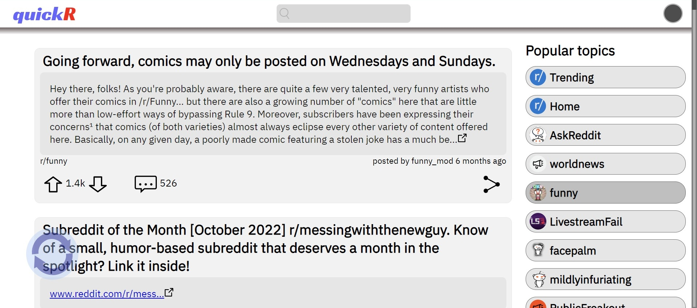

# [quickR](https://celadon-malabi-4b4a22.netlify.app/) - The Simpler Reddit Client

A client for quickly browsing trending Reddit posts and popular subreddits.

## Contents
 - [General Info](#general-info)
 - [Technologies Used](#technologies-used)
 - [Setup](#setup)
 - [Features](#features)
 - [How It Works](#how-it-works)
 - [Known Issues](#known-issues)

## General Info
This project was created as part of the [Codecademy Pro](https://www.codecademy.com/) course for [Front-End Engineer](https://www.codecademy.com/learn/paths/front-end-engineer-career-path) career path, to showcase in-depth understanding of HTML, CSS, JavaScript, React and Redux.

The app has been deployed [here] (https://celadon-malabi-4b4a22.netlify.app/)

## Technologies Used
* [HTML5](https://developer.mozilla.org/en-US/docs/Web/HTML)
* [CSS 3](https://developer.mozilla.org/en-US/docs/Web/CSS)
* [JavaScript ES6](https://developer.mozilla.org/en-US/docs/Web/JavaScript)
* [React 18.2.0](https://reactjs.org/)
* [React-Redux 8.0.2](https://react-redux.js.org/)
* [Redux Toolkit 1.8.5](https://redux-toolkit.js.org/)
* [Jest 27.5.1](https://jestjs.io/)
* [undocumented Reddit JSON API](https://github.com/reddit-archive/reddit/wiki/JSON)

## Setup
To run the application in your local environment:
- fork and download the repository
- within the app directory, run `npm install` to install [npm](https://www.npmjs.com/)
- run `npm start` to start the development server

## Features

The client can be used to navigate through the top 25 trending posts along with the latest 25 posts in the top most popular subreddits.

----

Search can also be used to display the latest 25 posts that match the searched term.

----

The posts are displayed with details such as the subreddit, the post's author and date, number of upvotes and number of comments.

----

The Share menu allows copying the URL or the code for embedding in a page, or sharing the post URL in an email - all referencing the actual Reddit post.

----

The user can display comments and navigate through the threads or replies, however for longer threads or large number of comments links will open the actual Reddit post in a new browser tab.

----

The app will adapt to various displays, from desktop and tablet to smartphone in either portrait or landscape mode. The functionality will remain intact, with some elements such as the search bar and the list of subreddits available to open using the buttons in the header.

----

The user can switch between light and dark mode display.

## How It Works
Upon opening, the app uses the [Reddit JSON API](https://github.com/reddit-archive/reddit/wiki/JSON) to fetch and display the top 25 trending posts along with the 25 most popular subreddits.
Clicking on a subreddit from the list will fetch and display the last 25 posts in that subreddit, same when clicking on the subreddit name of a specific post.

Using the search will return the top 25 matching posts.

Although the posts display the number of upvotes, actual voting is not possible because it requires the user to be logged into Reddit.

Pressing the comments button will display the post's comments along with replies - or as much as it can be fetched with the JSON API. In cases with thousand of comments, ***Continue this thread*** links will open the Reddit post in a new tab.

Clicking on the post's title also opens the Reddit post in a new browser tab.

Finally, the Share button can be used to copy the URL to the Reddit post or the embed code (which causes a notification message to be displayed), or to share the post's URL in an email.

Using the top rightmost button, the user can switch between light and dark mode display.

On narrower screens (portrait mode or under 768px), the app will adapt by hiding the search box and the list of subreddits which can be displayed using the buttons in the rearranged header.

## Known Issues
- videos have no sound. It's a limitation of the [Reddit JSON API](https://github.com/reddit-archive/reddit/wiki/JSON).
- in absence of an official documentation, I have tried to think of and cover as many post formats as possible, but I cannot guarantee I haven't left any out. Such posts would be shown as 'Unknown content type'.
